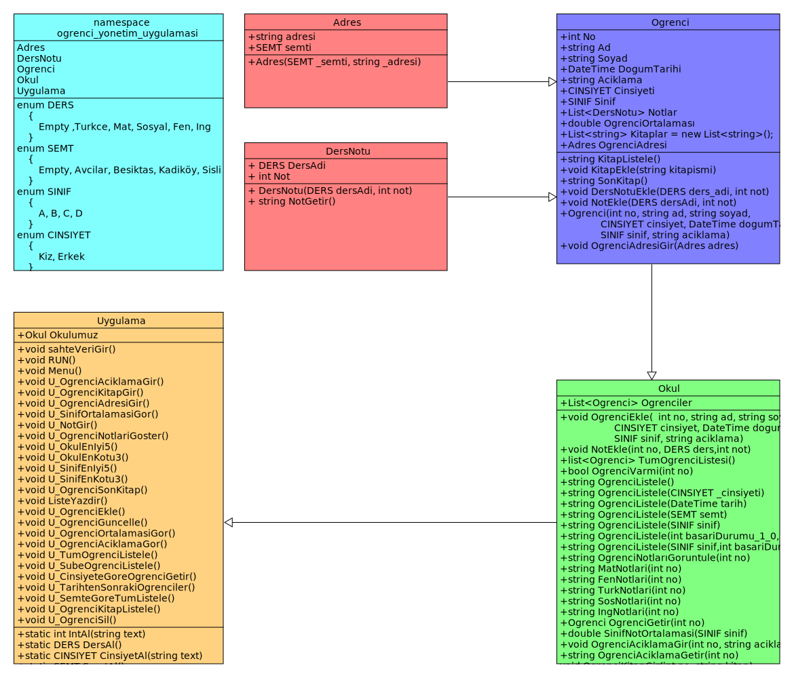

# Öğrenci Yönetim Uygulaması

## Nedir
> Öğrenci yönetim uygulaması C# da ki list yapısını kavramak amacı ile oluşturulmuş bir projedir.

## Özellikleri
 ----- Öğrenci Yönetim Uygulaması ----- 
1. Öğrenci Ekle
2. Not Gir
3. Öğrencinin ortalamasını gör
4. Öğrencinin adresini gir
5. Bütün Öğrencileri Listele
6. Şubeye Göre Öğrencileri Listele
7. Öğrencinin notlarını görüntüle
8. Sınıfın Not Ortalamasını Gör
9. Cinsiyetine göre öğrenci listele
10. Şu tarihten sonra doğan öğrencileri listele
11. Tüm öğrencileri semtlerine göre sıralayarak listele
12. Okuldaki En başarılı 5 öğrenciyi listele
13. Okuldaki En başarısız 3 öğrenciyi listele
14. Sınıftaki En başarılı 5 öğrenciyi listele
15. Sınıftaki En başarısız 3 öğrenciyi listele
16. Öğrenci için açıklama gir
17. Öğrencinin açıklamasını gör
18. Öğrencinin okuduğu kitabı gir
19. Öğrencinin okuduğu kitapları listele
20. Öğrencinin okuduğu son kitabı görüntüle
21. Öğrenci sil
22. Öğrenci güncelle

## UML Class diagram

## Kurulum
> Bilgisayarınızda .net kurulu olmalıdır
dosyaları indiriniz ve klasör içerisinde terminal açınız. Sonrada şu komutu giriniz **dotnet run**

## Ekip Üyeleri
> * Ömer Genç
> * Kasım Güneş
> * Ümitcan Kızılkaya

## Etiketler

## Planlama 1

Bu aşamada yazılacak olan bazı metodlara karar verildi

## Çalışma 1

Uygulama.cs hariç diğer tüm metodlar yazıldı

